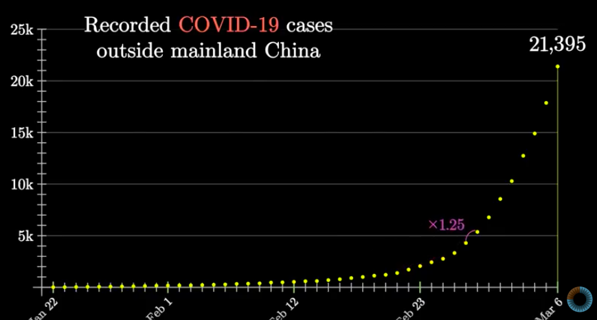
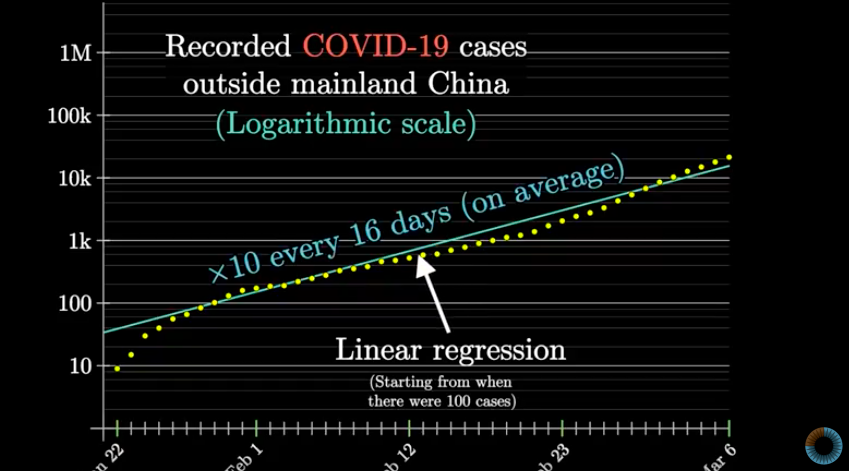
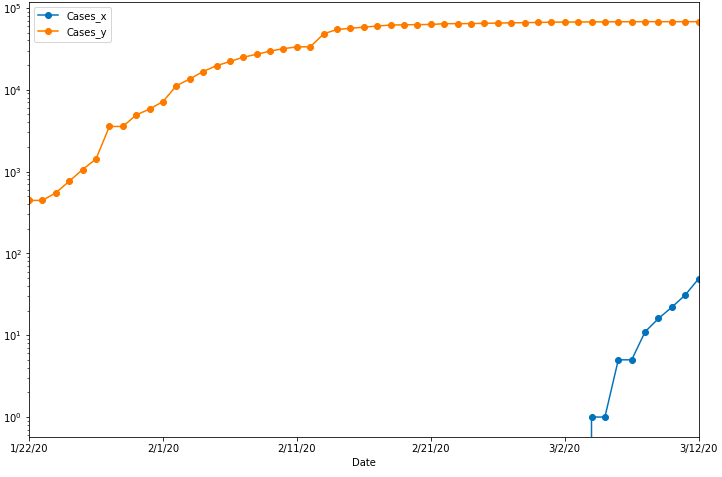
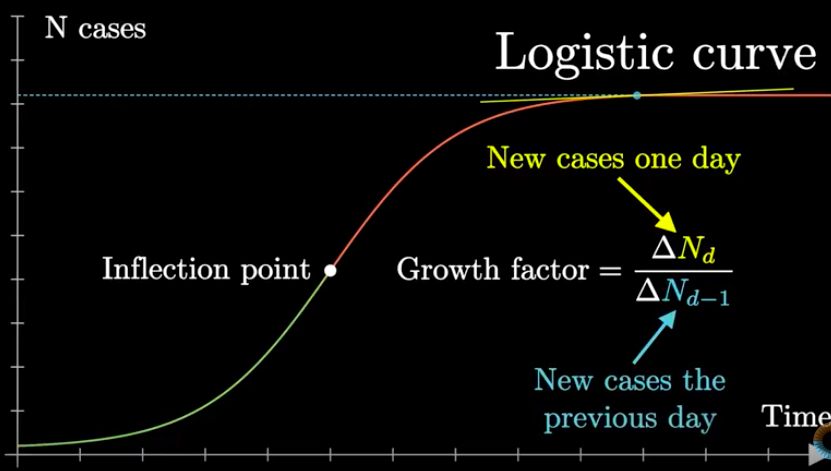

# Coronavirus. Simulation of Poland.

This article is a mathematically possible interpretation of the course of coronavirus infections in Poland.
The considerations are based on mathematical insights on the development of the disease in Central and Western Europe, they are quite general, but correctly depict the scenario of the future.

## General considerations.

A resident of Zielona Góra became the first patient in Poland diagnosed with coronavirus. It happened on March 4, 2020.
At the time of this "text" (March 13), we have 51 cases of this virus infection in Poland. What's next?

Consider the coronavirus chart:

The epidemic image is a pattern of an exponential function in the field of natural numbers (days), for each day the value of the function takes values greater by the product of a fixed number compared to the previous day. What is this "constant number"? It turns out to be a value between 1.11 and 1.27.

However, let's look at the logarithmic function of coronavirus:

The exponential increase looks like a straight line, we find that the value of the function increases on average ten times every 16 days. This is terrifying, it would mean that after 64 days in the world the number of infected will be 100 million people!  However, we can be calm: this line does not go on forever, eventually the function will stop growing exponentially. Why? The first option: the whole world will be infected, so you can no longer infect anyone. The second option is based on considering the past. For example: "Spanish flu" (1918) stopped after 513 million infections. However, we do not know if (and when) this will happen in the case of a coronavirus...

## The future of Poland against the backdrop of world events.

[orange: China; blue: Poland]

As you can see, coronavirus WILL BE a problem for Poland. China has already dealt with it, the number of infections there is increasing by around 150 people a day. China has therefore coped with the crisis.

## Methodology.

In general, two cases of virus spread should be considered. First: people are completely isolated from each other. Second: people move freely. Of course, we accept the second "case", because you can not thoughtlessly assume that everyone will spend all time in quarantine.
Finally, it can be concluded that a better graph depicting the virus will be a logarithmic graph, taking the factor of the general population and the option that no one can be infected twice (of course, unless he recovers).

Note that the "growth factor" (from the picture above) will be a number, let's call this number as 'c'. In addition, let's specify "inflection point" as the function value for the 'z' [f(z)] argument. We assume that the domain of functions are natural numbers (days).
As the function approaches the inflection point, the number 'c' will decrease (at the end: c = 1). 
For simplicity I assume that the average value of 'c' in the function will be: the 16th root of 10 (see above). Let c = 1.27 at the beginning. When in Poland c = 1.00? I do not know, it can be assumed that in a few weeks.
